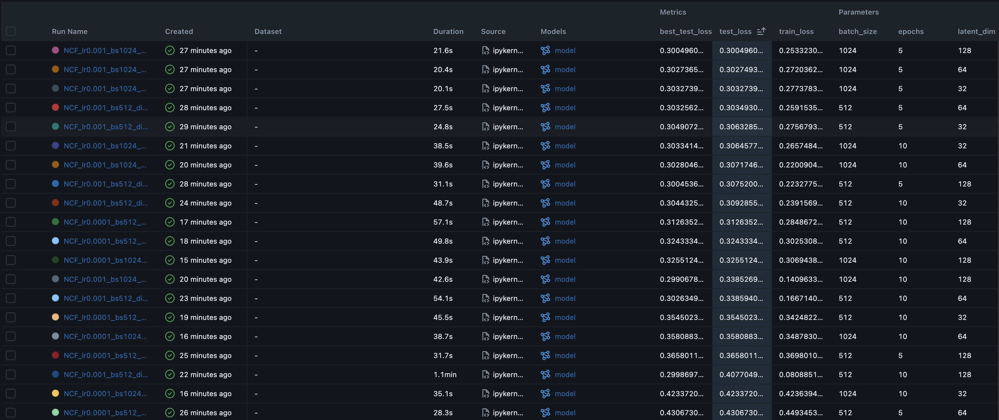

# MovieLens-TwoTower-RecSys

## 📊 Experiments & MLOps
MLflow를 도입하여 실험 환경을 구축하고, 하이퍼파라미터 튜닝을 통해 모델 성능을 최적화했습니다.

### 1. Experiment Tracking
Learning Rate(0.001 vs 0.0001), Batch Size(512 vs 1024), Embedding Dimension(32~128)을 조합하여 총 20회 이상의 실험을 수행했습니다.
- **Best Model:** Latent Dim 128, Batch Size 1024, LR 0.001 설정에서 가장 낮은 Test Loss(0.300)를 기록했습니다.

### 2. Training Results (Generalization Check)
Train/Test 데이터셋을 시간 순(Leave-One-Out)으로 분리하여 검증했습니다.
- **분석:** Epoch이 진행됨에 따라 Train Loss와 Test Loss가 동반 하락하며 수렴했습니다.
- **결론:** Overfitting 없이 일반화 성능이 확보되었음을 확인했습니다.

